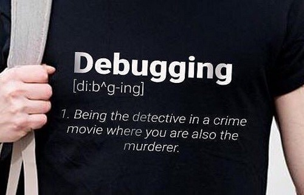
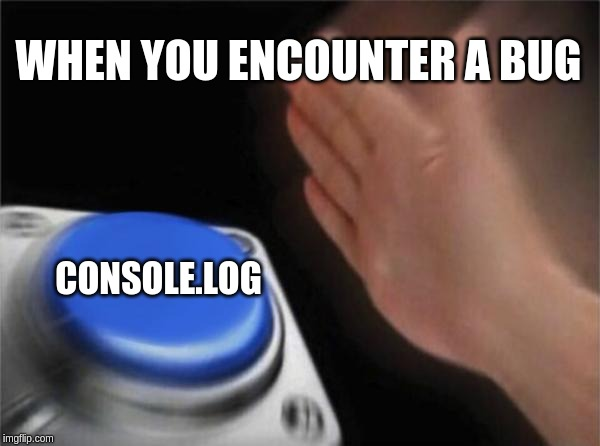
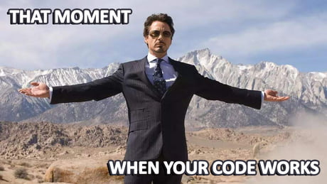

# Introduction to Debugging

## Prerequisites

-   JavaScript
-   Visual Studio Code

## Objectives

-   Students will be able to explain what debugging is and why it is important.
-   Students will be able to use a variety of developer tools in the Chrome browser to debug JavaScript errors.
-   Students will be able to use VS Code's built-in debugger to resolve JavaScript errors.

## Agenda

1. Preface
2. A Methodical Approach
3. Console Methods
4. Chrome and VS Code Debugger
5. Additional Resources

## Preface

Throughout this course and your developer career, you will encounter dozens of errors, or "bugs" in your code. These errors may be the result of problems with syntax, logic, scope, and so on. The process of determining the causes of these errors and resolving them is called "debugging."

Strong debugging skills are often considered to be one of the characteristics that separates junior developers from senior developers. During job interviews, potential employers may also ask you about a difficult bug you encountered and how you solved it. Having a methodical approach to debugging, understanding the range of available debugging tools, and getting practice at finding errors will help you to become a faster, more efficient debugger AND a better developer overall.

## A Methodical Approach to Debugging

These are a useful series of questions to ask yourself when starting the debugging process. Though we are focusing on debugging JavaScript today, the questions below can help you debug in any language.

1. **Where is my error?**
    - JavaScript often gives file and line numbers in its error messages, which can point you in the right direction.
    - Good code formatters also highlight problem areas (usually syntax issues), so look for red squiggly lines in VS Code .
    - You can also comment out code and comment it back in one block at a time to locate the source of the problem.
    - More sophisticated methods will be covered below!
2. **What is my code supposed to be doing?**
    - If you don't yet have pseudo-code or comments, add them in line by line to translate what you think your code is doing.
    - Sometimes this process alone helps you spot your error!
    - As you examine your code, consider issues such as scope, asynchronicity, hoisting, side effects, etc.
3. **How should I test my assumptions?**
    - Once you have a good understanding of what the code should be doing, use debugging tools to test whether your assumptions about the code are correct.
    - Determine where in the code to place console methods or a breakpoint.

Run the code and evaluate the results. If you return another error message, repeat the process until your code works the way you want it too.

> Remember to remove any console logs, breakpoints, and other debugging tools from code that will be deployed and any other projects that you plan to show employers.

## Console Methods

As a new developer, you probably rely heavily on console.log(). Console is a built-in JavaScript object, and like many other built-in objects (Arrays, Math, etc.) has a multitude of other methods (functions that belong to an object) available to us. In addition to console.log(), here are a few more that maybe useful to new developers.

###

### console.table

### console.error()

## Debugger

### Google Chrome

talk about how to use debugging techniques in Google Chrome

### Visual Studio Code

talk about built in debugging in VS code

## Conclusion

Getting errors in your code can be really frustrating, but they can also be really instructive and revealing. View errors as an opportunity to gain a deeper and more intuitive understanding of how JavaScript works, as well as a chance to become stronger at analytical thinking and problem solving. And you'll realize after finally solving your error that there is no better feeling than when your code finally runs the way it's supposed to.

## Additional Resources

-   W3 Schools provides a high-level overview of debugging [here](https://www.w3schools.com/js/js_debugging.asp).
-   This [video](https://www.youtube.com/watch?v=TtsvMRxmfGA) goes into much greater depth of all the different debugging tools available.
-   This [article](https://raygun.com/javascript-debugging-tips) covers common debugging techniques with good visuals of the code being used.
